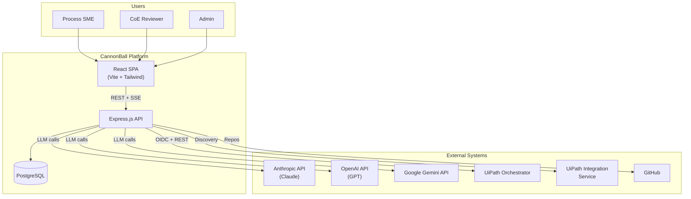
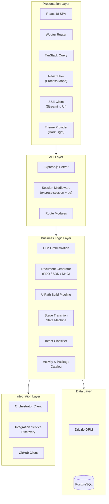
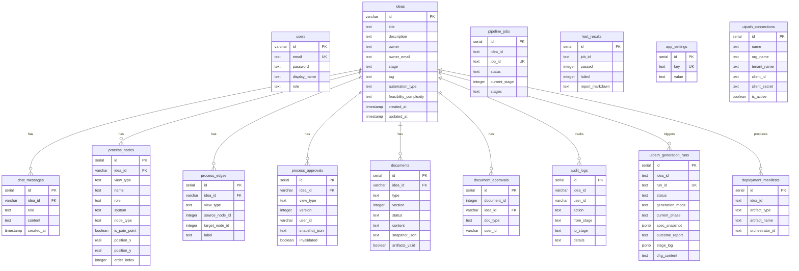
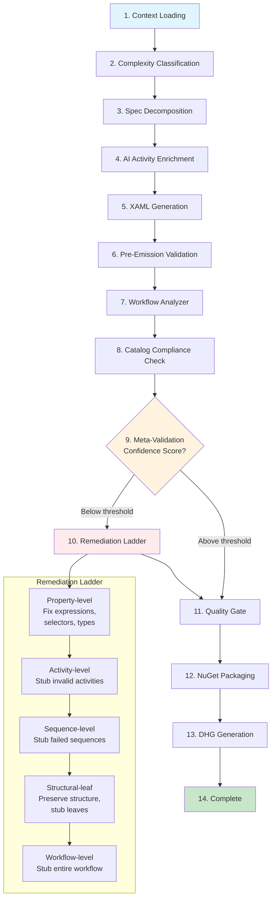

# CannonBall (CB2) — Technical Architecture

## Executive Summary

CannonBall (CB2) is an **Idea-to-Code** platform purpose-built for UiPath RPA development. It accelerates the journey from a business process idea to a deployable UiPath automation package (.nupkg) by combining AI-driven design assistance, structured document generation, visual process mapping, and an automated build pipeline.

The platform serves three user personas — **Process SMEs** who capture ideas and describe processes, **CoE (Center of Excellence) reviewers** who approve designs and govern quality, and **Admins** who manage users, LLM configuration, and UiPath connections. CannonBall guides each idea through a nine-stage lifecycle: Idea → Design → Feasibility Assessment → Build → Test → Governance/Security Scan → CoE Approval → Deploy → Maintenance.

By orchestrating multiple LLM providers (Anthropic, OpenAI, Google Gemini), CannonBall generates Process Design Documents (PDD), Solution Design Documents (SDD), Developer Handoff Guides (DHG), and production-ready XAML workflows — complete with meta-validation, remediation, and NuGet packaging — all within a single web application.

---

## Technology Stack

| Layer | Technology | Version | Purpose |
|-------|-----------|---------|---------|
| **Frontend Framework** | React | 18.3 | Component-based UI |
| **Build Tool** | Vite | — | Fast dev server & production bundler |
| **CSS Framework** | Tailwind CSS + Shadcn UI | — | Utility-first styling with accessible components |
| **Routing** | Wouter | 3.3 | Lightweight client-side routing |
| **Data Fetching** | TanStack React Query | 5.x | Server state management with caching |
| **Process Visualization** | @xyflow/react (React Flow) | 12.x | Interactive node-edge process maps |
| **Charts** | Recharts | 2.x | Data visualization for metrics |
| **Server Framework** | Express.js | 5.0 | REST API server |
| **ORM** | Drizzle ORM | 0.39 | Type-safe PostgreSQL queries |
| **Database** | PostgreSQL | — | Primary data store |
| **Session Store** | connect-pg-simple | 10.0 | Server-side sessions in PostgreSQL |
| **Schema Validation** | Zod + drizzle-zod | 3.x / 0.7 | Runtime type validation |
| **LLM — Anthropic** | @anthropic-ai/sdk | 0.78 | Claude model family |
| **LLM — OpenAI** | openai | 6.31 | GPT model family |
| **LLM — Google** | @google/genai | 1.45 | Gemini model family |
| **XML Processing** | fast-xml-parser | 5.x | XAML validation & parsing |
| **Package Assembly** | adm-zip / archiver | — | NuGet .nupkg creation |
| **Document Export** | docx | 9.5 | Word document generation |
| **File Parsing** | pdf-parse, mammoth, xlsx | — | PDF, DOCX, Excel ingestion |
| **GitHub Integration** | @octokit/rest | 21.x | Repository operations |
| **Runtime** | Node.js + tsx | — | TypeScript execution |

---

## System Context Diagram



---

## High-Level Component Architecture



### Presentation Layer

The frontend is a single-page React 18 application served by Vite with the following pages:

| Route | Page | Purpose |
|-------|------|---------|
| `/` | Home | Dashboard with idea pipeline overview |
| `/ideas` | Ideas | List and create automation ideas |
| `/workspace/:id` | Workspace | Full workspace for an individual idea — chat, process maps, documents, build pipeline |
| `/reviews` | Reviews | CoE review queue |
| `/guide` | Guide | Platform usage guide |
| `/settings` | Settings | LLM model selection, UiPath connections, user management |
| `/login` | Login | Authentication |

Key frontend patterns:
- **Sidebar navigation** via `AppSidebar` component with collapsible layout
- **Real-time streaming** via SSE for chat responses and pipeline progress
- **Interactive process maps** using React Flow with drag-and-drop node editing, as-is / to-be views, and approval workflows
- **Resizable panels** (`react-resizable-panels`) for the workspace layout
- **Dark/light theme** support via `ThemeProvider` with CSS variable toggling

### API Layer

Express.js serves both the REST API and the Vite-built frontend from a single server. Route modules are registered modularly:

| Module | Prefix | Responsibility |
|--------|--------|----------------|
| `routes.ts` | `/api/auth/*`, `/api/ideas/*`, `/api/users/*`, `/api/settings/*`, `/api/audit-logs` | Auth, ideas CRUD, user management, settings, audit logs |
| `chat/routes.ts` | `/api/ideas/:id/chat` | AI chat with intent classification, document generation triggers, approval handling |
| `process-map-routes.ts` | `/api/ideas/:id/process-map/*` | Process node/edge CRUD, approvals, auto-layout |
| `document-routes.ts` | `/api/ideas/:id/documents/*` | Document generation, versioning, approvals, export |
| `uipath-routes.ts` | `/api/uipath/*` | Build pipeline triggers, generation run status, package download, catalog |
| `file-upload.ts` | `/api/ideas/:id/upload` | File ingestion (PDF, DOCX, XLSX) |

Session management uses `express-session` with `connect-pg-simple` storing sessions in PostgreSQL. Authentication is session-cookie-based with role-aware access control.

### Business Logic Layer

#### LLM Orchestration
The `server/lib/llm.ts` module provides a **provider-agnostic interface** (`LLMProvider`) with three implementations:
- `AnthropicProvider` — Claude Sonnet 4, Haiku 4.5, Opus 4
- `OpenAIProvider` — GPT-4o, GPT-5, GPT-5.2, GPT-5.3 Codex
- `GeminiProvider` — Gemini 2.5 Pro, Gemini 2.5 Flash

Three separate model slots are configurable at runtime:
1. **Chat model** — used for conversational AI and document generation
2. **Code model** — used for XAML generation and enrichment (falls back to chat model if unset)
3. **Meta-validation model** — used for post-generation quality checks (defaults to Claude Haiku 4.5)

#### Document Generation Engine
Generates three document types from idea context (process maps, chat history, prior documents):
- **PDD (Process Design Document)** — Business-oriented process specification
- **SDD (Solution Design Document)** — Technical implementation blueprint
- **DHG (Developer Handoff Guide)** — Post-build guide with gaps, remediation steps, and deployment instructions

#### Stage Transition State Machine
The `stage-transition.ts` module evaluates whether an idea can advance through the pipeline stages based on artifact completeness:

| From Stage | Conditions to Advance |
|------------|----------------------|
| Idea → Design | ≥3 process nodes + ≥4 chat messages |
| Design → Feasibility Assessment | As-is process map approved |
| Feasibility Assessment → Build | Automation type assessed + To-be process map approved |
| Build → Test | SDD exists and approved |
| Test → Governance / Security Scan | Automatic (testing phase complete) |
| Governance / Security Scan → CoE Approval | Automatic (governance scan passed) |
| CoE Approval → Deploy | Automatic (CoE approval granted) |
| Deploy → Maintenance | Automatic (deployment complete) |

> **Note:** The later stages (Test through Deploy) currently advance unconditionally when evaluated. As the platform matures, these gates will incorporate automated test results, security scan reports, and explicit CoE approval workflows.

#### Intent Classification
The chat system uses keyword-based and LLM-assisted intent classification to detect:
- Document generation requests (PDD, SDD, DHG)
- Approval intents (for documents and process maps)
- Build pipeline triggers
- Process map editing commands
- Feasibility assessment requests

### Data Layer

PostgreSQL via Drizzle ORM with type-safe schemas defined in `shared/schema.ts` and `shared/models/*.ts`.

### Integration Layer

- **UiPath Orchestrator Client** (`orchestrator-client.ts`) — OAuth2 (OIDC) authenticated REST client for managing processes, queues, assets, machines, and storage buckets
- **Integration Service Discovery** (`uipath-integration.ts`) — Probes available UiPath services (Orchestrator, Action Center, Test Manager, Document Understanding, Generative Extraction)
- **Activity & Package Catalog** (`catalog/`) — Maintains a registry of available UiPath activities, packages, and Studio profiles for accurate XAML generation
- **GitHub Client** (`@octokit/rest`) — Repository operations for source control integration

---

## Data Model Overview



The **`ideas`** table is the central entity. All other domain objects cascade from it via `idea_id` foreign keys with `ON DELETE CASCADE`. This ensures that deleting an idea cleanly removes all associated process maps, documents, chat history, generation runs, and audit records.

---

## AI/LLM Architecture

### Provider Abstraction

```
┌──────────────────────────────────────────────┐
│              LLMProvider Interface            │
│  create(options) → Promise<LLMResponse>       │
│  stream(options) → LLMStream (async iterator) │
└─────────┬──────────┬──────────┬──────────────┘
          │          │          │
   ┌──────▼───┐ ┌───▼────┐ ┌──▼──────┐
   │ Anthropic │ │ OpenAI │ │ Gemini  │
   │ Provider  │ │Provider│ │Provider │
   └──────────┘ └────────┘ └─────────┘
```

Each provider implements two methods:
- **`create()`** — Single-shot request/response for document generation, XAML enrichment, and meta-validation
- **`stream()`** — Returns an `AsyncIterator<LLMStreamEvent>` for real-time token streaming

The provider layer handles:
- Message format translation (Anthropic `MessageParam`, OpenAI `ChatCompletionMessageParam`, Gemini `contents` array)
- Multimodal content (images via base64 for all three providers)
- Timeout management via `withTimeout()` wrapper (default 120s, 240s for SDD generation)
- Model-specific parameter handling (e.g., `max_completion_tokens` vs `max_tokens` for newer GPT models)
- Automatic provider detection from model ID via `SUPPORTED_MODELS` registry

### Streaming Architecture (SSE)

```
Browser                    Express Server                  LLM Provider
  │                            │                               │
  │──── POST /chat ───────────►│                               │
  │                            │── stream(system, messages) ──►│
  │                            │                               │
  │◄─── SSE: text_delta ──────│◄──── text_delta ──────────────│
  │◄─── SSE: text_delta ──────│◄──── text_delta ──────────────│
  │◄─── SSE: text_delta ──────│◄──── text_delta ──────────────│
  │                            │                               │
  │◄─── SSE: done ────────────│◄──── stop ────────────────────│
  │                            │                               │
  │                            │── save to DB ─────────────────│
```

Chat responses stream via **Server-Sent Events (SSE)**. The server iterates over the `LLMStream` async iterator, forwarding `text_delta` events to the client as they arrive. When the stream completes, the full response is persisted to the `chat_messages` table.

The pipeline build also uses SSE to report stage-by-stage progress with heartbeat events every 3.5 seconds to keep the connection alive during long-running operations.

### Model Slots

| Slot | Default | Configurable | Used For |
|------|---------|-------------|----------|
| Chat Model | `claude-sonnet-4-6` | Yes (Admin) | Conversational AI, document generation, intent classification |
| Code Model | Falls back to Chat | Yes (Admin) | XAML activity enrichment, spec decomposition, workflow generation |
| Meta-Validation Model | `claude-haiku-4-5` | Yes (Admin) | Post-generation XAML correction, confidence scoring |

---

## UiPath Build Pipeline

The build pipeline is the core value engine of CannonBall. It transforms a process map and design documents into a deployable UiPath NuGet package.



### Pipeline Stages in Detail

1. **Context Loading** — Gathers the idea description, SDD/PDD documents, process map nodes and edges, and chat history into a unified `IdeaContext`.

2. **Complexity Classification** — Analyzes the process structure and categorizes the automation complexity (simple, moderate, complex) to inform generation strategy.

3. **Spec Decomposition** — Uses the Code LLM to decompose the process into individual workflow specifications, determining if a REFramework (Dispatcher/Performer) pattern is needed.

4. **AI Activity Enrichment** — For each workflow, the Code LLM selects appropriate UiPath activities from the catalog, assigns properties, specifies error handling, and identifies gaps (selectors, credentials, endpoints that need human attention).

5. **XAML Generation** — Converts enriched specs into valid UiPath XAML using the `xaml-generator.ts` engine, applying REFramework templates when applicable.

6. **Pre-Emission Validation** — Validates all activities against the catalog, strips unknown activities, fixes enum values, and corrects property syntax before emitting final XAML.

7. **Workflow Analyzer** — Runs structural analysis on generated XAML, checking variable naming conventions, argument validation, annotation coverage, and display name compliance.

8. **Catalog Compliance Check** — Verifies that all referenced activities exist in the known package catalog and that template compliance meets quality standards.

9. **Meta-Validation** — An AI-powered second pass that:
   - Calculates a **confidence score** based on error signals (XML validity, catalog violations, structural issues)
   - If the score falls below the auto-engage threshold, triggers LLM-based correction
   - Parses correction suggestions and applies them to the XAML

10. **Remediation Ladder** — A multi-level fallback strategy ensuring the pipeline always produces a usable output:
    - **Property-level**: Fix bad expressions, missing selectors, unsupported types
    - **Activity-level**: Replace invalid activities with annotated stubs
    - **Sequence-level**: Stub out sequences with multiple failures
    - **Structural-leaf**: Preserve parent structure, stub leaf activities
    - **Workflow-level**: Replace entire workflow with a stub if unrecoverable

11. **Quality Gate** — Final validation pass that checks for blocking issues and collects warnings.

12. **NuGet Packaging** — Assembles XAML files, `project.json`, dependency declarations, and metadata into a valid `.nupkg` file ready for UiPath Orchestrator upload.

13. **DHG Generation** — Produces a Developer Handoff Guide documenting all gaps, remediations, auto-repairs, quality warnings, and estimated manual effort.

### Generation Modes

The pipeline supports adaptive generation modes that can downgrade if the process complexity exceeds the LLM's capability:

| Mode | Description |
|------|-------------|
| `full_implementation` | Fully generated XAML with all activities and logic |
| `stubbed` | Structure preserved with placeholder stubs for complex sections |
| `skeleton` | Minimal workflow skeleton for manual completion |

---

## Real-Time Communication

### SSE Streaming Pattern

All long-running operations use Server-Sent Events for real-time progress:

```
Client                          Server
  │                               │
  │── GET /api/uipath/build ─────►│
  │                               │── Pipeline starts
  │◄── event: progress ──────────│   Stage: "Context Loading"
  │◄── event: heartbeat ─────────│   (every 3.5s)
  │◄── event: progress ──────────│   Stage: "Spec Decomposition"
  │◄── event: heartbeat ─────────│   (every 3.5s)
  │◄── event: progress ──────────│   Stage: "XAML Generation"
  │    ...                        │
  │◄── event: complete ──────────│   Package ready
  │                               │
  │── GET /api/uipath/download ──►│
  │◄── Binary .nupkg ────────────│
```

The `PipelineStageTracker` class manages:
- **Stage start/complete** events with elapsed time tracking
- **Heartbeat** intervals (3.5s) to prevent connection timeouts
- **Warning** events for non-blocking issues
- **Failure** events with error context

### Chat Streaming

Chat responses stream tokens to the UI as they are generated by the LLM, providing responsive feedback even for long-form document generation (PDD/SDD can take 30-60 seconds to generate).

---

## Security & Authentication

### Authentication Flow

```
Login Form → POST /api/auth/login → Validate credentials → Create session → Set cookie
                                                                   │
                                                        ┌──────────┴──────────┐
                                                        │  express-session     │
                                                        │  + connect-pg-simple │
                                                        │  → PostgreSQL        │
                                                        └─────────────────────┘
```

- Sessions are stored server-side in PostgreSQL via `connect-pg-simple`
- Session cookies are `httpOnly` with a 24-hour TTL
- All `/api/*` routes check `req.session.userId` before processing

### Role-Based Access Control

| Role | Capabilities |
|------|-------------|
| **Process SME** | Create ideas, edit own ideas, use chat, manage process maps, generate documents, trigger builds |
| **CoE** | All SME capabilities + approve documents and process maps, advance ideas through governance stages |
| **Admin** | All CoE capabilities + manage users, change roles, configure LLM models, manage UiPath connections, delete any idea |

Users can switch their active role at runtime (within their permission level) via `POST /api/auth/switch-role`.

### Governance Quality Gates

- **Process Map Approval** — Requires explicit approval (with snapshot) before stage advancement
- **Document Approval** — PDD and SDD require approval before downstream stages unlock
- **Build Quality Gate** — Automated checks for XAML validity, catalog compliance, and structural integrity
- **Audit Logging** — All significant actions (stage transitions, approvals, model changes, deletions) are recorded in the `audit_logs` table with user attribution

---

## Deployment Architecture

```
┌──────────────────────────────────────────────┐
│              Replit Container                 │
│                                              │
│  ┌────────────────────────────────────────┐  │
│  │          Express.js Server             │  │
│  │                                        │  │
│  │  ┌──────────┐   ┌──────────────────┐   │  │
│  │  │ REST API │   │ Vite Dev Server / │   │  │
│  │  │ /api/*   │   │ Static Assets    │   │  │
│  │  └──────────┘   └──────────────────┘   │  │
│  │                                        │  │
│  └────────────────────────────────────────┘  │
│                     │                        │
│            ┌────────▼─────────┐              │
│            │   PostgreSQL     │              │
│            │   (Replit DB)    │              │
│            └──────────────────┘              │
│                                              │
└──────────────────────────────────────────────┘
         │              │              │
    ┌────▼────┐   ┌─────▼─────┐  ┌────▼────┐
    │Anthropic│   │  OpenAI   │  │ Gemini  │
    │   API   │   │   API     │  │   API   │
    └─────────┘   └───────────┘  └─────────┘
```

- **Single-process deployment**: One Express.js server handles both API requests and serves the frontend
- **Development**: `tsx server/index.ts` runs with Vite dev server middleware for hot module replacement
- **Production**: `npm run build` compiles the frontend with Vite and bundles the server; `npm start` serves the compiled output
- **Database**: Replit-managed PostgreSQL with Drizzle ORM for migrations via `drizzle-kit push`
- **External API keys**: Managed via Replit AI Integrations for Anthropic, OpenAI, and Gemini; UiPath credentials stored in the `uipath_connections` table
- **Session persistence**: PostgreSQL-backed sessions survive server restarts

---

## Appendix: Key File Map

| Directory | Key Files | Purpose |
|-----------|----------|---------|
| `shared/` | `schema.ts`, `models/*.ts` | Database schemas, types, validation |
| `server/` | `routes.ts`, `storage.ts` | Core API routes, storage interface |
| `server/lib/` | `llm.ts` | LLM provider abstraction |
| `server/` | `uipath-pipeline.ts` | Build pipeline orchestration |
| `server/` | `xaml-generator.ts` | XAML code generation engine |
| `server/` | `ai-xaml-enricher.ts` | AI-driven activity specification |
| `server/meta-validation/` | `index.ts`, `meta-validator.ts`, `confidence-scorer.ts`, `correction-applier.ts`, `cost-tracker.ts` | Post-generation quality assurance |
| `server/` | `orchestrator-client.ts` | UiPath Orchestrator API client |
| `server/catalog/` | `catalog-service.ts`, `metadata-service.ts`, `studio-profile.ts`, `xaml-template-builder.ts` | Activity/package catalog and templates |
| `server/` | `stage-transition.ts` | Pipeline stage advancement logic |
| `server/replit_integrations/chat/` | `routes.ts`, `storage.ts` | Chat system with intent classification |
| `client/src/` | `App.tsx`, `pages/*.tsx` | React frontend application |
| `client/src/components/` | `process-map-panel.tsx`, `app-sidebar.tsx` | UI components |
| `client/src/hooks/` | `use-auth.tsx` | Authentication context |
